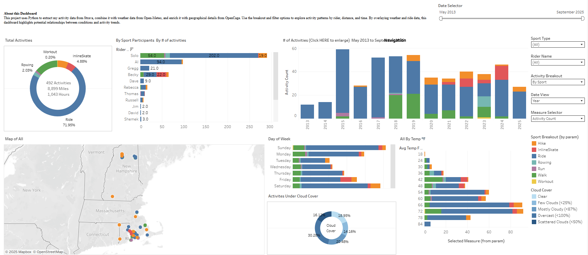

# 🚴‍♂️ Strava → Google Sheets ETL Pipeline
**Incremental ride ingestion with weather, reverse-geocoding, and Tableau dashboards**

[]()
[](LICENSE)
[]()

---

### 🌟 Overview
This project automates extraction of personal **Strava** activity data, enriches it with **weather** and **reverse-geocoded** location details, and writes the results to a connected **Google Sheet** for analysis in **Tableau Public**.

It’s designed to be:
- **Incremental** – only new or missing rides are pulled  
- **Cache-aware** – weather and geo lookups are stored to avoid API overuse  
- **Portfolio-ready** – demonstrates practical ETL, API handling, and BI visualization  

---

## 🏗️ Architecture

```text
          +-------------+        +------------------+
          |  Strava API | -----> |  pipeline.py     |
          +-------------+        |  (activities &   |
                                 |  rider parsing)  |
                                        |
                                        v
                         +--------------------------------+
                         |  Google Sheet (Strava Rides)   |
                         |--------------------------------|
                         | activities_all  | riders_long  |
                         | weather_hourly  | weather_by_ride |
                         | revgeo_cache    | geo_by_ride   |
                         +--------------------------------+
                                        |
                          +------------------------------+
                          | Tableau Public Dashboard     |
                          | (distance, duration, weather) |
                          +------------------------------+


```

---

## 📊 Tableau Dashboard

View it on Tableau Public →  
🔗 [**Strava Rides Dashboard**](https://public.tableau.com/app/profile/daniel.mccomb4807)

*Example preview:*  


---

📄 Tabs & Purpose
Sheet Tab	Description
activities_all	Raw Strava activity data (ID, start time, distance, etc.)
riders_long	Flattened riders/co-participants per ride (long form)
weather_hourly	Hour-level weather pulled from Open-Meteo
weather_by_ride	Aggregated weather summary per ride (join key: activity_id)
revgeo_cache	Cache of latitude/longitude → city/state lookups
geo_by_ride	Final location table joined by activity_id
⚙️ Setup
1️⃣ Clone & install (for local use)

If you want to run the ETL locally on your own machine:

git clone https://github.com/danieljmc/dan-strava-rides.git
cd dan-strava-rides
pip install -r requirements.txt

2️⃣ Environment variables

Create a local .env (use .env.example as a guide).
Never upload real keys.

STRAVA_CLIENT_ID=
STRAVA_CLIENT_SECRET=
STRAVA_ACCESS_TOKEN=
GOOGLE_SERVICE_ACCOUNT_JSON=path/to/creds.json
SECRET_LAT=      # fallback for indoor rides
SECRET_LON=

3️⃣ Google Sheet connection

Create a Google Sheet (e.g., Strava Rides (ETL)).

Share it with your Service Account email (Editor access).

The ETL scripts will create the tabs automatically.

🚀 Usage

Run the ETL scripts manually or via automation:

# 1) Pull new activities + riders
python pipeline.py

# 2) Fetch or update missing weather
python weather_etl.py

# 3) Reverse-geocode missing lat/lon
python geocode_etl.py

🔁 Incremental Logic

Activities: Skips any IDs already in activities_all

Weather: Updates only rides missing weather data

Geo: Looks up only uncached lat/lon pairs

This keeps the pipeline efficient and idempotent (safe to re-run).

🧩 Design Choices
Decision	Rationale
Pre-aggregated weather	Keeps Tableau fast by avoiding hourly joins
Separate rider table	Supports many-to-many rider ↔ activity relationships
Incremental caching	Reduces API hits, faster reloads
Fallback coordinates	Handles indoor rides gracefully
📦 Repository Contents
dan-strava-rides/
│
├── pipeline.py            # Main ETL (activities + riders)
├── weather_etl.py         # Weather enrichment
├── geocode_etl.py         # Reverse-geocoding
│
├── sheets_smoke_test.py   # Test Google Sheet connection
├── weather_smoke_test.py  # Verify weather API response
├── geo_smoke_test.py      # Verify geocoding API response
│
├── docs/
│   └── tableau_preview.png
├── .env.example
├── requirements.txt
├── LICENSE
└── README.md

⚠️ Limitations & Future Enhancements

Indoor rides use a fixed fallback coordinate

Weather granularity varies by region

Future ideas:

Add GitHub Action for nightly runs

Optional SQLite/BigQuery export

Lightweight Streamlit dashboard

🪪 License

Distributed under the MIT License. See LICENSE
 for details.

🙋‍♂️ About the Author

Daniel McComb — Analyst • Data Visualization • Cyclist
🔗 Tableau Public


---

### ✅ How to apply it
1. Open your repo → click **README.md** → click the ✏️ **Edit** icon.  
2. Delete everything inside.  
3. Paste *all* of the text above (starting at `# 🚴‍♂️` and ending at the final link).  
4. Scroll down → click **Commit changes**.  

That’s your complete, final README — everything will render correctly with the diagram, the Tableau link, and the preview image.
